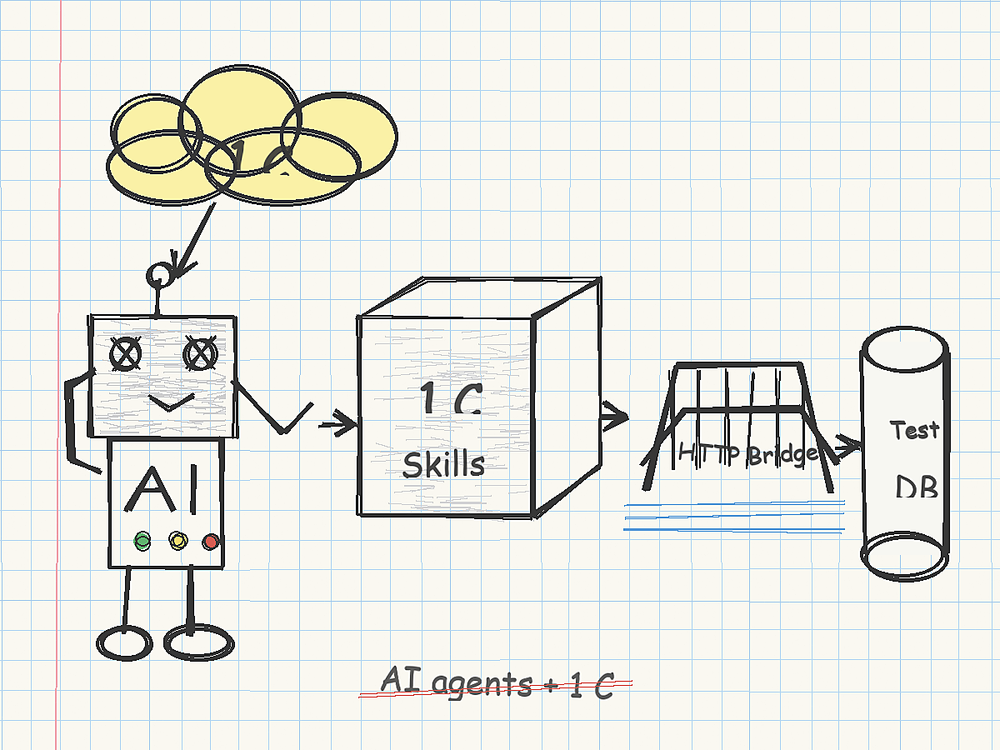

# 1C Skills для ИИ-агентов: инструменты для разработки, проверки и тестирования 1С



ИИ-агенты уже умеют писать код, но в 1С-разработке одной генерации текста мало. Агенту нужен понятный контекст: как устроены XML-исходники конфигурации, как собрать EPF/ERF, как проверить форму, как применить изменения в базу, как открыть веб-клиент и как убедиться, что результат реально работает.

Я собрал набор локальных skills для ИИ-агентов под 1С:Предприятие:

[https://github.com/msrv-tech/skills](https://github.com/msrv-tech/skills)

Это не один большой промпт, а каталог из 82 специализированных навыков. Каждый skill лежит в отдельной папке, содержит `SKILL.md`, а для практических сценариев еще и скрипты, reference-файлы, evals и примеры. Такой формат можно использовать в Codex, Claude Code и других агентных средах, где есть локальные инструкции и инструменты.

## Что Внутри

Репозиторий закрывает основные рабочие сценарии 1С-разработчика:

- конфигурации: `cf-init`, `cf-info`, `cf-edit`, `cf-validate`, `cf-new-project`, `cf-add-object`
- расширения: `cfe-init`, `cfe-borrow`, `cfe-patch-method`, `cfe-diff`, `cfe-validate`
- метаданные: `meta-compile`, `meta-edit`, `meta-info`, `meta-remove`, `meta-validate`
- управляемые формы, макеты, роли, подсистемы, СКД и MXL
- внешние обработки и отчеты: `epf-*`, `erf-*`
- информационные базы: создание, загрузка XML/CF, выгрузка XML/CF, обновление, запуск
- веб-публикация через Apache и браузерные smoke-тесты через Playwright
- отдельное расширение `codex-test-bridge`, которое дает HTTP API для тестовых баз 1С

Полный список навыков:

- [SKILLS_TABLE.md](https://github.com/msrv-tech/skills/blob/main/SKILLS_TABLE.md)
- [skills-index.csv](https://github.com/msrv-tech/skills/blob/main/skills-index.csv)

## Почему Skills, А Не Один Большой Промпт

В 1С много локальных правил, которые трудно держать в голове агента все время:

- формат XML-выгрузки 1С
- имена коллекций метаданных и вложенных объектов
- права ролей
- структура управляемых форм
- особенности MXL и СКД
- команды Конфигуратора и `ibcmd`
- различия между CF, CFE, EPF и ERF
- ограничения веб-публикации

Если все это положить в один системный промпт, он станет тяжелым и неуправляемым. Skills решают задачу иначе: агент подтягивает конкретный навык тогда, когда он нужен. Например, для создания справочника используется `meta-compile`, для проверки формы - `form-validate`, для публикации базы - `web-publish`.

## Главная Фишка: Test Bridge Для 1С

Самая важная часть набора - [codex-test-bridge](https://github.com/msrv-tech/skills/tree/main/codex-test-bridge). В репозитории он пока называется именно так, но по смыслу это универсальный test bridge для любого ИИ-агента.

Это служебное расширение 1С для демо- и тестовых баз. Оно публикует HTTP-сервис `codex-test` и дает внешнему агенту JSON API поверх базы.

Внутри папки:

- [src/](https://github.com/msrv-tech/skills/tree/main/codex-test-bridge/src) - XML-исходники расширения
- [codex-test-bridge.cfe](https://github.com/msrv-tech/skills/blob/main/codex-test-bridge/codex-test-bridge.cfe) - готовое собранное расширение
- [client.py](https://github.com/msrv-tech/skills/blob/main/codex-test-bridge/client.py) - Python-клиент для вызова HTTP API
- [BRIDGE.md](https://github.com/msrv-tech/skills/blob/main/codex-test-bridge/BRIDGE.md) - спецификация endpoints и команд
- [scripts/](https://github.com/msrv-tech/skills/tree/main/codex-test-bridge/scripts) - сборка CFE и включение HTTP-сервиса в `default.vrd`

### Какую Проблему Он Решает

Обычный ИИ-агент может изменить XML-файлы, но дальше ему нужно проверить результат. В 1С это не всегда просто:

- COM-подключение доступно не везде
- Linux-агент не может напрямую использовать Windows COM
- UI-тесты медленные и хрупкие
- многие проверки требуют живой базы, а не только файлов
- внешнюю печатную форму или отчет нужно не только собрать, но и реально сформировать

Bridge закрывает этот разрыв. Агент получает HTTP API и может работать с тестовой базой как с проверяемым runtime-контуром.

### Что Умеет Bridge

Через HTTP можно:

- проверить доступность базы командой `Health`
- получить список метаданных через `Metadata`
- описать объект метаданных через `Describe`
- выполнить запрос 1С через `Query`
- выполнить серверный BSL-код через `ExecuteBSL`
- вызвать экспортный метод общего модуля через `CallCommonModule`
- создать или обновить элемент справочника либо документ через `WriteObject`
- прочитать объект по UUID через `GetObject`
- поставить или снять пометку удаления через `DeleteObject`
- проверить внешнюю печатную форму через `RenderExternalPrintForm`
- проверить внешний отчет через `RenderExternalReport`

Спецификация API:

[https://github.com/msrv-tech/skills/blob/main/codex-test-bridge/BRIDGE.md](https://github.com/msrv-tech/skills/blob/main/codex-test-bridge/BRIDGE.md)

### Почему Это Важно Для Агентной Разработки

Без bridge агент часто останавливается на фразе “код изменен, проверьте в 1С”. С bridge можно построить другой цикл:

1. Агент создает или меняет объект в XML.
2. Загружает изменения в тестовую базу.
3. Устанавливает расширение `CodexTestBridge`.
4. Публикует базу в веб-клиенте.
5. Вызывает HTTP API.
6. Создает тестовые данные.
7. Выполняет запросы и серверные проверки.
8. Формирует внешнюю печатную форму или отчет.
9. Сохраняет результат в `mxl`, `html`, `txt`.
10. Проверяет текст, таблицы, итоги и ошибки.

Это уже не “ИИ написал код”. Это ближе к полноценной автоматизированной разработке, где агент может сам подтвердить, что артефакт работает.

## Пример: Проверка Доступности Bridge

После установки CFE и публикации базы HTTP-сервис доступен по адресам:

```text
http://<host>/<publication>/hs/codex-test/health
http://<host>/<publication>/hs/codex-test/command
```

Python-клиент:

```powershell
python <skills-root>\codex-test-bridge\client.py `
  --base-url http://127.0.0.1:9091/demo1c/hs/codex-test health
```

Метаданные:

```powershell
python <skills-root>\codex-test-bridge\client.py `
  --base-url http://127.0.0.1:9091/demo1c/hs/codex-test `
  metadata --sections catalogs,documents
```

Запрос:

```powershell
python <skills-root>\codex-test-bridge\client.py `
  --base-url http://127.0.0.1:9091/demo1c/hs/codex-test `
  query "ВЫБРАТЬ ПЕРВЫЕ 10 Ссылка, Наименование ИЗ Справочник.Контрагенты" --limit 10
```

## Пример: Проверка Внешней Печатной Формы Без UI

Особенно интересны команды `RenderExternalPrintForm` и `RenderExternalReport`.

Для внешней печатной формы bridge создает внешнюю обработку из EPF, берет документ по UUID или первый документ нужного вида, вызывает экспортную процедуру/функцию `СформироватьПечатнуюФормуДляТеста(МассивОбъектов)` и сохраняет результат.

```powershell
python <skills-root>\codex-test-bridge\client.py `
  --base-url http://127.0.0.1:9091/demo1c/hs/codex-test `
  render-print-form D:\temp\customer-order-print.epf `
  --output-dir D:\temp\print-render `
  --assignment Документ.ЗаказПокупателя `
  --document-name ЗаказПокупателя
```

На выходе можно получить `mxl`, `html`, `txt`. Это дает агенту возможность проверять не только факт сборки EPF, но и содержимое печатной формы: заголовки, строки, итоги, дубли, пустые области.

Для внешнего отчета аналогично:

```powershell
python <skills-root>\codex-test-bridge\client.py `
  --base-url http://127.0.0.1:9091/demo1c/hs/codex-test `
  render-report D:\temp\sales-report.erf `
  --output-dir D:\temp\report-render
```

В отчете должна быть экспортная функция `СформироватьОтчетДляТеста(Параметры)`, которая возвращает `ТабличныйДокумент`.

## Безопасность

Bridge предназначен только для локальных демо- и тестовых баз.

Его нельзя подключать к боевым базам и нельзя публиковать наружу. API выполняет серверные операции в базе, включая выполнение BSL-кода и запись объектов. Это сознательно сделано для тестового контура, где агенту нужно быстро проверить результат разработки.

Обычный `web-publish` в наборе skills публикует базу безопаснее, без HTTP-сервисов расширений. Для bridge HTTP-сервис включается отдельным helper-скриптом:

[enable_vrd_windows.ps1](https://github.com/msrv-tech/skills/blob/main/codex-test-bridge/scripts/enable_vrd_windows.ps1)

## Как Установить

Самый простой способ - не устанавливать все руками, а поручить это своему ИИ-агенту.

Откройте Codex, Claude Code или другой агентный инструмент и напишите примерно так:

```text
Добавь в мой локальный набор skills навыки из репозитория:
https://github.com/msrv-tech/skills

Разбери README, SKILLS_TABLE.md и структуру папок.
Установи skills так, чтобы ты мог использовать их в дальнейшей работе с 1С.
```

Дальше агент сам разберется: клонирует репозиторий или скачает нужные папки, найдет `SKILL.md`, проверит зависимости, подскажет, что нужно установить локально, и подключит навыки в формате своей среды.

Если нужен именно bridge для тестовой базы, можно дать агенту отдельную задачу:

```text
Установи codex-test-bridge из этого репозитория в мою тестовую базу 1С.
Используй BRIDGE.md и scripts/ как инструкцию, боевую базу не трогай.
```

То есть ссылка на репозиторий - это входная точка. Остальное лучше делать через агента: он уже умеет читать файлы, сверять инструкции, запускать команды и адаптировать установку под конкретную машину.

## Что Получается В Итоге

Такие skills превращают ИИ-агента из “редактора с автодополнением” в инженерного помощника, который понимает конкретные операции 1С:

- создать объект метаданных
- добавить форму
- собрать внешнюю обработку
- загрузить конфигурацию в базу
- опубликовать веб-клиент
- вызвать HTTP API тестовой базы
- сформировать печатную форму или отчет
- проверить результат автоматически

Главное здесь - не магия нейросети, а правильная упаковка контекста и инструментов. Агент становится полезнее тогда, когда рядом с ним лежат маленькие, точные, проверяемые навыки.

Репозиторий:

[https://github.com/msrv-tech/skills](https://github.com/msrv-tech/skills)

Bridge:

[https://github.com/msrv-tech/skills/tree/main/codex-test-bridge](https://github.com/msrv-tech/skills/tree/main/codex-test-bridge)
