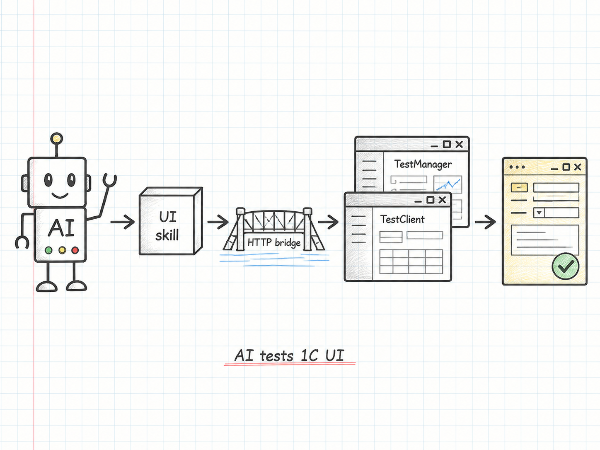
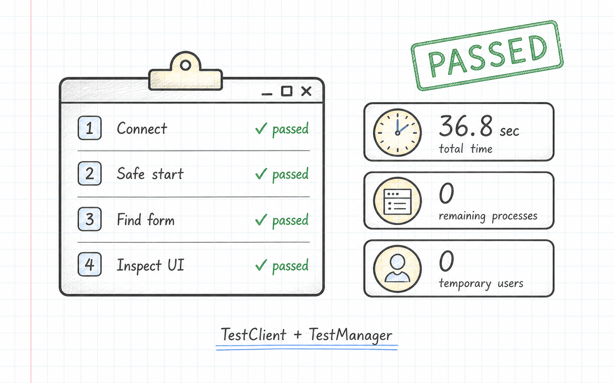
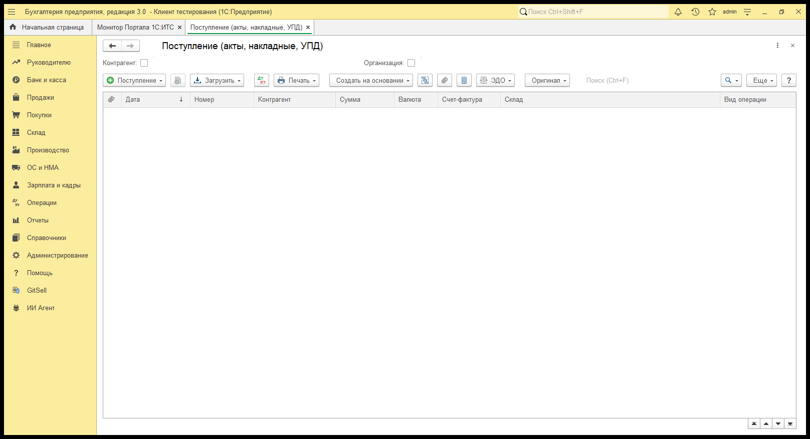

# UI-тесты 1С для ИИ-агентов: TestClient через HTTP bridge



ИИ-агент может написать BSL, изменить XML-исходники, собрать расширение и даже проверить запросы в живой базе. Но как только нужно убедиться, что форма действительно открылась, поле доступно, ссылка выбрана, строка появилась в таблице, начинается самая дорогая часть автоматизации — пользовательский интерфейс 1С.

Через браузер неудобно: веб-клиент не всегда опубликован, DOM не является моделью управляемой формы, лицензирование и поведение отличаются от тонкого клиента. Через `pywinauto` и похожие инструменты тоже тяжело: координаты, фокус, DPI, перекрывающиеся окна и нестабильные подписи быстро превращают тест в хрупкий сценарий сопровождения самого теста.

Раньше `CodexTestBridge` закрывал серверную часть: HTTP health, метаданные, запросы, выполнение BSL, создание тестовых объектов, внешние отчеты и печатные формы. Теперь bridge умеет управлять штатной связкой `/TestClient` + `/TestManager` и выполнять семантические UI-сценарии. По назначению это близко к Vanessa Automation, но точка сборки смещена в сторону ИИ-агентов: JSON-команды короткие, диагностические данные машинные, а подготовка и очистка данных остаются в серверном API.

Код и готовое CFE находятся в репозитории:

[https://github.com/msrv-tech/skills/tree/main/codex-test-bridge](https://github.com/msrv-tech/skills/tree/main/codex-test-bridge)

## Что внутри

- зачем агенту штатный TestClient, если уже есть Playwright и `pywinauto`;
- как bridge связывает ИИ-агента, `/TestManager` и настоящий клиент 1С;
- компактный JSON DSL для форм, полей, таблиц и ссылочных значений;
- реальный сценарий на БП 3.0: открыть и заполнить приходную накладную;
- артефакты, диагностика, безопасность и очистка процессов.

## Почему браузер и pixel automation не закрывают задачу

У каждого привычного варианта есть сильная сторона, но для автономного агента быстро проявляются ограничения.

### Веб-клиент и Playwright

Playwright прекрасен для обычных веб-приложений, однако веб-клиент 1С — это дополнительный слой над управляемым приложением. Агент видит HTML-представление, а не `ТестируемаяФорма`, `ТестируемоеПолеФормы` или `ТестируемаяТаблицаФормы`. При этом тест зависит от публикации, браузера и отличий веб-клиента от тонкого клиента.

### pywinauto, UI Automation и координаты

Инструменты Windows UI Automation полезны для диагностики и остаются fallback-механизмом в worker. Но поле формы может выглядеть как обычный текстовый контрол, хотя внутри 1С оно хранит ссылку. Записать туда строку — не то же самое, что выбрать объект справочника. Координаты и распознавание картинок ещё слабее: они ломаются от масштаба, темы и перестановки элементов.

### Штатный TestClient

Платформа уже содержит объектную модель тестирования. Проблема была не в отсутствии API, а в оркестрации: нужно запустить два процесса, связать их портом, передать сценарий, дождаться результата, собрать диагностику и гарантированно всё закрыть. Именно эту рутину теперь берёт на себя bridge.

## Главная фишка: UI-тестирование через bridge

В сценарии участвуют четыре компонента:

1. ИИ-агент формирует небольшой JSON-сценарий.
2. Python worker создаёт задание `uiJobCreate` через HTTP bridge.
3. В изолированном desktop запускаются 1С `/TestClient` и `/TestManager`.
4. Встроенный менеджер CFE исполняет атомарные действия через штатную модель тестирования и возвращает структурированный результат в bridge.

На Windows используется отдельный невидимый Win32 desktop. Он не переключает рабочий стол пользователя и не перехватывает его мышь. На Linux ту же роль выполняет Xvfb. По таймауту worker завершает только созданные им процессы.



## Минимальный тест

Самая короткая проверка подтверждает, что TestManager действительно подключился к TestClient:

```json
{
  "name": "Подключение TestManager к TestClient",
  "steps": [
    {
      "name": "Проверить штатное соединение с тестовым клиентом",
      "action": "assertConnected"
    }
  ]
}
```

Это уже не HTTP health. В тесте реально стартуют клиент и менеджер 1С, устанавливается соединение по протоколу тестирования платформы, результат возвращается через задание bridge, а процессы закрываются.

## Показательный тест на реальной БП 3.0

Проверка стартовой панели мало что говорит о пригодности инструмента для прикладной работы. Поэтому следующий сценарий выполнен на опубликованной демобазе «Бухгалтерия предприятия 3.0» и проходит настоящий пользовательский путь: открывает журнал поступлений, создаёт «Товары (накладная, УПД)», заполняет номер входящего документа, выбирает существующего поставщика нативной формой выбора, проверяет реквизиты и закрывает документ без записи.

```json
{
  "name": "Заполнение приходной накладной без записи",
  "steps": [
    {
      "action": "openNavigationLink",
      "link": "e1cib/list/Документ.ПоступлениеТоваровУслуг",
      "targetForm": {
        "formName": "Документ.ПоступлениеТоваровУслуг.Форма.ФормаСписка",
        "saveAs": "receipts",
        "timeout": 90
      }
    },
    {
      "action": "click",
      "form": "receipts",
      "button": {"objectName": "СоздатьПоступлениеТовары"}
    },
    {
      "action": "waitForm",
      "formName": "Документ.ПоступлениеТоваровУслуг.Форма.ФормаДокументаТовары",
      "saveAs": "receipt",
      "timeout": 90
    },
    {
      "action": "inputText",
      "form": "receipt",
      "field": {"objectName": "НомерВходящегоДокумента"},
      "value": "AI-TEST-2608"
    },
    {
      "action": "selectReference",
      "form": "receipt",
      "field": {"objectName": "Контрагент"},
      "strategy": "choiceForm",
      "choiceForm": {"title": "Контрагенты"},
      "table": {"objectName": "Список"},
      "row": {"Наименование в программе": "Банк"}
    },
    {
      "action": "assertField",
      "form": "receipt",
      "field": {"objectName": "НомерВходящегоДокумента"},
      "expected": "AI-TEST-2608"
    },
    {
      "action": "closeForm",
      "form": "receipt",
      "onPrompt": "discard",
      "waitClosed": true
    }
  ]
}
```

Это не подмена текста в Windows-контроле. `selectReference` открывает форму «Контрагенты», находит строку таблицы `Список` и возвращает в реквизит настоящую ссылку 1С. В отдельном диагностическом прогоне bridge получил структуру формы документа: `Контрагент`, `ДоговорКонтрагента`, `Организация`, `Склад`, таблицу `Товары`, `НомерВходящегоДокумента` и `Комментарий`. Открытие и инспекция накладной завершились со статусом `passed`: 7 шагов, 63,3 секунды, TestManager `0`. Выбор существующего контрагента также прошёл: 8 шагов, 50,1 секунды.



Полные воспроизводимые сценарии лежат рядом со статьёй: [`tests/05-receipt-document-inspect.ui.json`](tests/05-receipt-document-inspect.ui.json), [`tests/06-receipt-fill.ui.json`](tests/06-receipt-fill.ui.json) и диагностический выбор поставщика [`tests/07-receipt-counterparty-inspect.ui.json`](tests/07-receipt-counterparty-inspect.ui.json).

## Что может делать UI DSL

Набор команд ориентирован на действия, которые удобно генерировать и анализировать агенту:

- `assertConnected`, `waitForm`, `waitElement`, `assertElement`;
- `inspectUi`, `inspectTable`, `inspectCommandInterface`;
- `openNavigationLink`, `executeCommand`, `clickCommandInterface`;
- `inputText`, `setCheckbox`, `click`;
- `openChoice`, `selectTableRow`, `assertTableRow`, `inputTableCell`;
- `selectReference` со стратегиями dropdown, type-ahead и формы выбора;
- `assertField`, `handleDialog`, `closeForm` с безопасным отказом от записи.

Особенно важна команда `selectReference`. UI Automation умеет заменить отображаемый текст поля, но это не гарантирует установку настоящей ссылки в модели формы. Bridge использует `ТестируемоеПолеФормы`, поэтому результат соответствует ручному выбору объекта пользователем.

## Почему агенту теперь проще писать UI-тесты

Человеку трудно заранее угадать внутренние имена всех форм, кнопок и колонок конкретной конфигурации. ИИ-агенту это тоже не нужно. Он может строить тест итеративно: открыть форму, выполнить `inspectUi` или `inspectTable`, получить фактические `formName`, `objectName` и названия колонок, а затем дописать следующий точный шаг.

Вместо длинного сценария с координатами получается короткая цепочка проверяемых действий:

1. открыть объект по `e1cib/...`;
2. дождаться формы по `formName`;
3. найти элемент по `objectName`;
4. выполнить одно действие;
5. проверить полученное значение;
6. безопасно закрыть форму или перейти к следующему шагу.

JSON Schema сразу отсекает неизвестные действия и неверную структуру сценария. Если конфигурация отличается от ожидаемой, агент получает не скриншот с фразой «что-то не нажалось», а номер шага, исходную ошибку TestClient и семантическое дерево доступных форм. Поэтому он может исправить конкретный селектор или ожидание, не переписывая весь тест.

### Не нужно ждать завершения всего теста

UI-worker не превращает запуск в «чёрный ящик» на несколько минут. Встроенный TestManager сохраняет промежуточный результат после каждого шага, а worker раз в секунду опрашивает задание bridge. Агент сразу видит стадии `starting`, `startup`, `connect`, `running`, `waiting`, `cleanup` и конечный статус `passed` или `failed`.

Для долгого шага каждые 10 секунд приходит heartbeat. В нём отдельно указаны текущий шаг, `stepElapsedSeconds` и общее время запуска. Поэтому агент понимает, что 1С продолжает работать, видит, на какой форме или ожидании находится сценарий, и может отличить тяжёлое открытие документа от зависания.

Тот же поток атомарно записывается в `progress.json`, поэтому его можно читать параллельно с работающим тестом. После завершения `summary.json` содержит компактный итог и последний успешный шаг, `worker.json` — полный отчёт, а `ui-diagnostics.json` — дерево интерфейса при ошибке. Агент получает обратную связь по мере выполнения, а не только один большой отчёт в самом конце.

## Серверная подготовка + UI-проверка

UI DSL намеренно не содержит циклов, переменных, fixtures и сложной логики. Это не ограничение, а разделение ответственности:

- серверный bridge быстро создаёт исходные данные, выполняет запросы и очищает fixtures;
- UI-worker проверяет только пользовательский путь;
- серверный bridge после UI-теста подтверждает состояние базы.

Такой сценарий хорошо подходит агенту: подготовить контрагента по HTTP, открыть документ через `e1cib/data/...`, выбрать ссылочные поля нативными действиями, закрыть форму без записи или проверить созданный объект запросом.

## Запуск из PowerShell

В примерах статьи есть wrapper, который получает базу только из приватного `test-databases.json`, подставляет параметры через окружение и не печатает пароли:

```powershell
.\tests\run-demo.ps1 `
  -Scenario .\tests\06-receipt-fill.ui.json `
  -ArtifactDir D:\temp\codex-ui-demo
```

Worker сохраняет:

- `summary.json` — компактный итог;
- `worker.json` — полный отчёт;
- `progress.json` — heartbeat и текущий шаг;
- `ui-diagnostics.json` — деревья форм и окон при ошибке;
- `screenshot.bmp` — снимок скрытого desktop.

## Безопасность и очистка

Bridge предназначен только для демо- и тестовых баз. HTTP-сервис нельзя публиковать наружу: он выполняет серверные команды с широкими возможностями.

Для автоматического запуска worker может создать случайных скрытых пользователей `ctb_ui_target_*` и `ctb_ui_manager_*`. Они живут только в рамках одного запуска и удаляются в `finally`. После показательного теста отдельно проверено: временных пользователей — 0, процессов 1С с run ID — 0.

Аргументы `/S`, `/N`, `/P` и секретные параметры маскируются в отчётах. Реальные URL, пользователи и пароли хранятся вне репозитория в приватном реестре.

## Это замена Vanessa Automation?

Скорее соседний инструмент. Vanessa — зрелый стек сценарного тестирования с собственным языком и большой экосистемой. CodexTestBridge решает более узкую задачу: дать ИИ-агенту компактный, машинно-читаемый и управляемый контур над штатным TestClient.

Смещение заметно в деталях:

- JSON вместо человекоориентированного feature-файла;
- прямые `objectName`, `formName` и структурированные результаты;
- HTTP для fixtures и проверки состояния;
- диагностика, которую агент может разобрать без просмотра экрана;
- изолированный жизненный цикл процессов;
- короткие атомарные действия вместо большого универсального сценарного языка.

## Что получилось

Bridge перестал быть только серверным тестовым API. Теперь один и тот же контур позволяет агенту:

1. подготовить данные в живой базе;
2. запустить настоящий тонкий клиент;
3. выполнить действия через штатную модель TestClient;
4. получить дерево формы и точную диагностику;
5. проверить результат на сервере;
6. гарантированно убрать процессы и временных пользователей.

Это ещё не «магическая кнопка» для любых интерфейсов 1С. Стартовые диалоги, права БСП и особенности конкретной конфигурации никуда не исчезают. Но теперь эти проблемы проявляются как структурированные данные, с которыми ИИ-агент действительно может работать, а не как случайный пиксель на чужом экране.

## Материалы

- [1C Skills для ИИ-агентов: инструменты для разработки, проверки и тестирования 1С](https://infostart.ru/1c/articles/2705751/)
- [CodexTestBridge](https://github.com/msrv-tech/skills/tree/main/codex-test-bridge)
- [Контракт UI-worker](https://github.com/msrv-tech/skills/blob/main/codex-test-bridge/UI_WORKER.md)
- [Примеры UI-сценариев](https://github.com/msrv-tech/skills/tree/main/codex-test-bridge/examples)
- [Набор skills для 1С](https://github.com/msrv-tech/skills)
